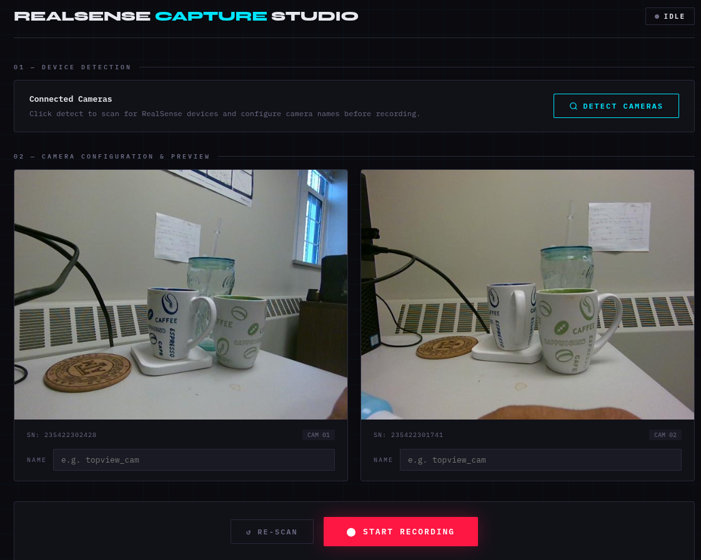

# RealSense Capture Studio

A browser-based UI for synchronized multi-camera recording with Intel RealSense depth cameras. Live previews stream to your browser, recordings are saved as `.bag` files, and a utility script converts them to colorized depth MP4 videos.

---

## Branches

This repository has two versions of the server:

| Branch | Stack | Description |
|--------|-------|-------------|
| `main` | Python + Flask | Original version. Easy to set up with Conda. |
| `go_version` | Go (single binary) | Rewrite with lower RAM usage, no GIL, real-time SSE updates, decoupled preview, and faster recording pipeline. Recommended for production use. |

### Switching to the Go version

```bash
git checkout go_version
```

Then follow the setup instructions in that branch's `README.md`. The quickest path on Ubuntu:

```bash
chmod +x install.sh
./install.sh          # installs Go, librealsense2, OpenCV, udev rules
source ~/.bashrc
go mod init realsense-capture
go mod tidy
make run              # real hardware
make run-demo         # no hardware needed
```

### Why consider switching?

- **No Python / Conda / virtualenv** — compiles to a single binary
- **No GIL** — frame grabbing, JPEG encoding, and HTTP serving run on true parallel threads
- **~260 MB RAM** with 2 cameras vs ~400+ MB with the Python version
- **Real-time SSE updates** — UI state is pushed from server instantly, no polling
- **Preview never interrupts recording** — the MJPEG stream stays live through start/stop cycles
- **Instant save** — `.bag` files are written frame-by-frame during recording, so Stop is immediate
- **Configurable output directory** — set the save path directly from the UI

---

## Requirements (Python / `main` branch)

- Linux (Ubuntu 22.04+ recommended)
- Intel RealSense D400-series camera(s)
- Conda (Miniconda or Anaconda)
  - If not installed, run `miniconda_installation.sh`:
    ```bash
    source miniconda_installation.sh
    ```
- `ffmpeg` (installed by `setup.sh`)

---

## Installation

Run the setup script to create the Conda environment and install all dependencies:

```bash
source setup.sh
```

---

## Running the Server

```bash
python app.py
```

The server starts on `http://0.0.0.0:5050`. Open your browser and go to:

```
http://localhost:5050
```

---

## Using the UI

### 1. Detect Cameras

Click **Detect / Re-scan** to enumerate connected RealSense devices. Each detected camera appears as a card with a live color preview feed.

- If no cameras are connected, the app runs in **demo mode** with mock preview feeds.
- If previews freeze, click **Detect / Re-scan** again — it restarts all preview pipelines.

### 2. Name Your Cameras

Each camera card has a **Name** field. Enter a descriptive label (e.g., `topview`, `sideview_left`). This name is used as the folder and filename for the recording output.

### 3. Start Recording

Click **Start Recording**. The sequence is:

1. All camera pipelines initialize in parallel (up to 10 seconds).
2. A **3-second warmup countdown** is displayed on each camera card — this ensures the hardware FIFO is fresh before capture begins.
3. All cameras receive the GO signal simultaneously and begin recording.
4. A **REC** indicator and elapsed timer appear on each card.

### 4. Stop Recording

Click **Stop Recording** at any time. The server:

1. Signals all camera threads to stop.
2. Finalizes and closes each `.bag` file.
3. Displays the saved file paths and any dropped frame counts.

### 5. Review Output

After recording completes, a **Saved Files** panel shows the `.bag` path for each camera and how many frames were dropped (if any).

---

## Output File Structure

```
recordings/
└── 13032026/               # Date: DDMMYYYY
    ├── topview/
    │   └── topview_20260313_143022.bag
    └── sideview/
        └── sideview_left_20260313_143022.bag
```

---

## Converting `.bag` to Depth Video

Use `bag_depth_video.py` to convert one or more `.bag` files to colorized depth MP4s.

**Convert a whole directory:**

```bash
python bag_depth_video.py recordings/13032026/topview depth_videos/topview
```

**Arguments:**

| Argument | Description |
|---|---|
| `bag_dir` | Directory containing `.bag` files (searched recursively at top level) |
| `output_dir` | Output directory for `.mp4` files (created if it doesn't exist). Defaults to `depth_videos/` |

Output filenames mirror the input: `topview_20260313_143022.bag` → `topview_20260313_143022.mp4`.

Depth values are normalized to a 0–5 meter range and colorized using OpenCV's `COLORMAP_JET` (blue = near, red = far).

---

## Scripted / Headless Recording (No UI)

For automated pipelines, use `cam_controller.py` directly:

```bash
python cam_controller.py
```

This detects all connected cameras, records for 10 seconds, and exports depth videos. Edit the `duration` variable and output paths at the bottom of the file to customize.

---

## API Reference

The Flask server exposes these endpoints (base URL: `http://localhost:5050`):

| Method | Endpoint | Description |
|---|---|---|
| `GET` | `/api/detect` | Detect connected cameras and start preview streams |
| `GET` | `/api/stream/<serial>` | MJPEG stream for a camera by serial number |
| `POST` | `/api/start_recording` | Start synchronized recording. Body: `{"cameras": [{"serial": "...", "user_name": "..."}]}` |
| `POST` | `/api/stop_recording` | Stop all recording and finalize `.bag` files |
| `GET` | `/api/status` | Get current status: `idle`, `warming`, `recording`, `saving`, or `done` |
| `POST` | `/api/restart_previews` | Restart all preview pipelines (use if feeds freeze) |

---